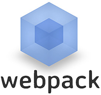

<!-- Main -->

<!-- One -->
<section id="one">
	

		<header class="major">
			<h1>Skill Inventory</h1>
		</header>
		<ul class="skill-list">
            <li></li>
            <li></li>
            <li></li>
            <li></li>
            <li></li>
            <li></li>
            <li></li>
            <li></li>
            <li></li>
            <li></li>
            <li></li>
            <li></li>
            <li></li>
        </ul>
    

</section>

